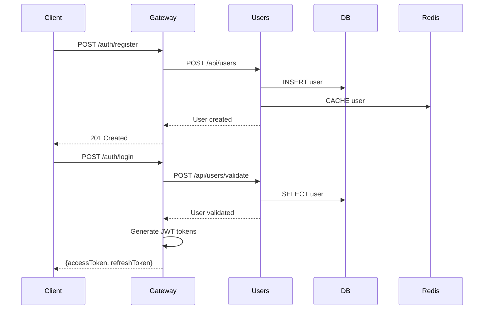
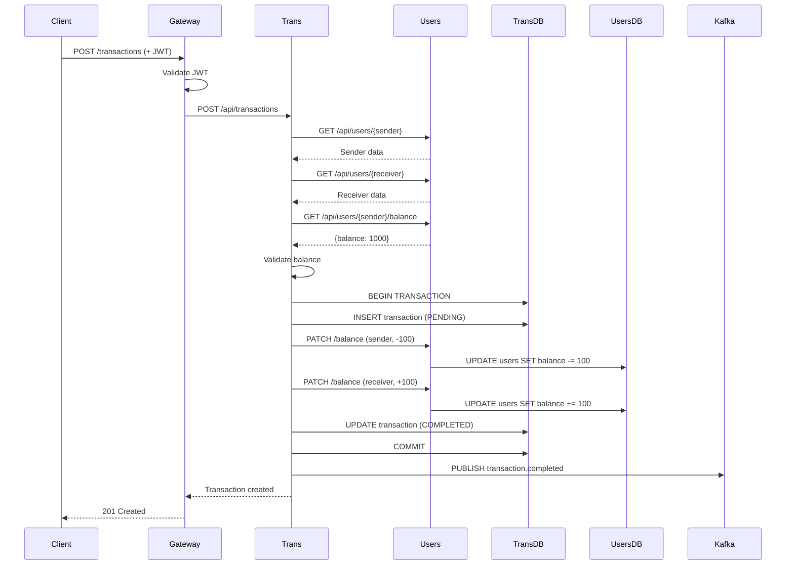
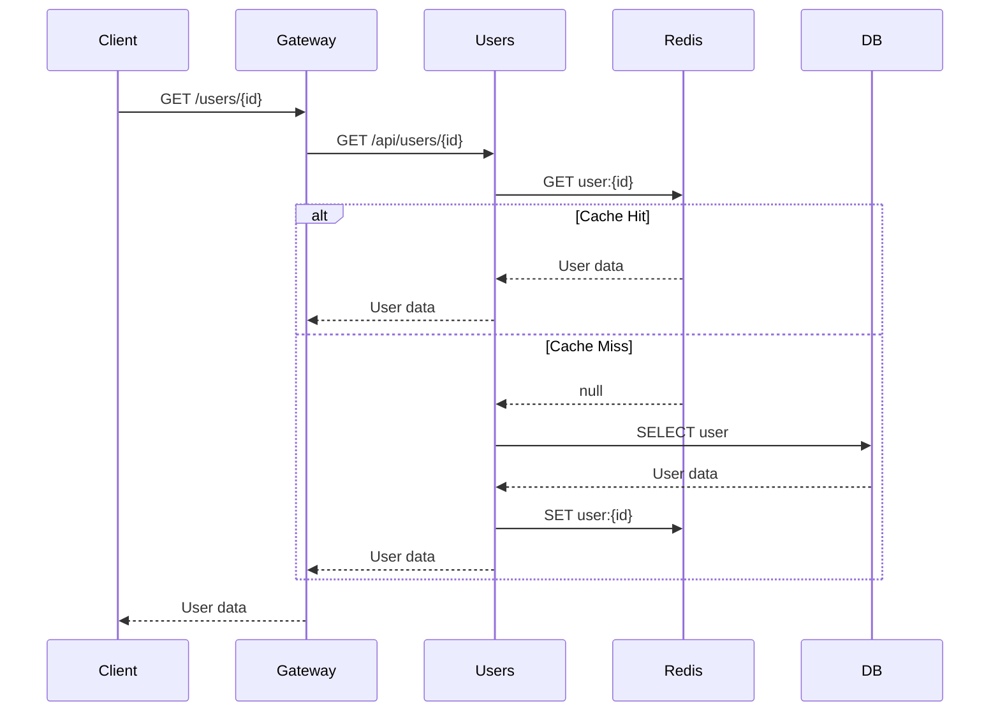

# Arquitetura do Sistema Loomi Banking

## Visão Geral

O sistema Loomi Banking é construído usando arquitetura de microsserviços, onde cada serviço é independente, escalável e possui sua própria responsabilidade.

## Diagrama de Arquitetura

```
┌─────────────────────────────────────────────────────────────────┐
│                          Cliente/Frontend                        │
└──────────────────────────────┬──────────────────────────────────┘
                               │
                               │ HTTPS
                               ▼
┌─────────────────────────────────────────────────────────────────┐
│                        API Gateway (Port 3000)                   │
│  ┌──────────────────────────────────────────────────────────┐  │
│  │  • JWT Authentication (Access + Refresh Tokens)          │  │
│  │  • Rate Limiting (100 req/min)                           │  │
│  │  • Request Validation                                    │  │
│  │  • Correlation ID Generation                             │  │
│  │  • Reverse Proxy                                         │  │
│  └──────────────────────────────────────────────────────────┘  │
└────────────────┬──────────────────────┬─────────────────────────┘
                 │                      │
        ┌────────▼────────┐    ┌───────▼────────┐
        │  Users Service  │    │  Transactions  │
        │   (Port 3001)   │◄───┤    Service     │
        │                 │    │  (Port 3002)   │
        └────────┬────────┘    └───────┬────────┘
                 │                     │
         ┌───────┼─────────────────────┼───────┐
         │       │                     │       │
    ┌────▼───┐ ┌▼────────┐      ┌────▼───┐  ┌▼─────────┐
    │  PG    │ │  Redis  │      │  PG    │  │  Kafka   │
    │ Users  │ │  Cache  │      │ Trans  │  │ + Zook   │
    └────────┘ └─────────┘      └────────┘  └──────────┘

Legend:
PG = PostgreSQL Database
Redis = Redis Cache
Kafka = Apache Kafka Message Broker
Zook = Zookeeper
```

## Componentes Principais

### 1. API Gateway

**Responsabilidades:**
- Ponto de entrada único para todos os clientes
- Autenticação e autorização JWT
- Rate limiting e proteção contra abuse
- Roteamento de requisições para microsserviços
- Agregação de documentação Swagger

**Tecnologias:**
- NestJS
- Passport JWT
- @nestjs/throttler
- Helmet (security headers)
- http-proxy-middleware

**Endpoints:**
- `POST /auth/register` - Registro de usuário
- `POST /auth/login` - Autenticação
- `POST /auth/refresh` - Renovação de token
- `GET /users/*` - Proxy para Users Service
- `POST /transactions/*` - Proxy para Transactions Service
- `GET /health` - Health check agregado
- `GET /metrics` - Métricas de aplicação

### 2. Users Service

**Responsabilidades:**
- Gerenciamento de usuários e seus dados
- Armazenamento de informações bancárias
- Upload de fotos de perfil para S3
- Gerenciamento de saldo
- Cache de dados de usuário
- Publicação de eventos de mudança de dados

**Tecnologias:**
- NestJS
- TypeORM + PostgreSQL
- Redis (cache)
- AWS S3 SDK
- KafkaJS (producer)
- bcrypt (hash de senhas)

**Banco de Dados:**
```sql
users
├── id (UUID, PK)
├── name (VARCHAR)
├── email (VARCHAR, UNIQUE)
├── password (VARCHAR, HASHED)
├── address (VARCHAR)
├── profilePicture (VARCHAR, S3 URL)
├── bankingDetails (JSONB)
│   ├── agency
│   ├── accountNumber
│   └── accountType
├── balance (DECIMAL)
├── isActive (BOOLEAN)
├── createdAt (TIMESTAMP)
└── updatedAt (TIMESTAMP)
```

**Eventos Kafka Publicados:**
- `user.banking-details.updated`
- `user.balance.updated`

### 3. Transactions Service

**Responsabilidades:**
- Processamento de transações financeiras
- Validação de saldo
- Comunicação síncrona com Users Service
- Gerenciamento de transações distribuídas
- Auditoria de transações
- Publicação de eventos de transação

**Tecnologias:**
- NestJS
- TypeORM + PostgreSQL
- @nestjs/axios (comunicação inter-serviços)
- KafkaJS (producer + consumer)

**Banco de Dados:**
```sql
transactions
├── id (UUID, PK)
├── senderUserId (UUID, FK)
├── receiverUserId (UUID, FK)
├── amount (DECIMAL)
├── description (VARCHAR)
├── status (ENUM: PENDING, COMPLETED, FAILED, REVERSED)
├── type (ENUM: TRANSFER, DEPOSIT, WITHDRAWAL)
├── metadata (JSONB)
├── createdAt (TIMESTAMP)
└── processedAt (TIMESTAMP)
```

**Eventos Kafka:**
- **Publicados:**
  - `transaction.completed`
  - `transaction.failed`
- **Consumidos:**
  - `user.banking-details.updated`
  - `user.balance.updated`

### 4. Apache Kafka

**Responsabilidades:**
- Mensageria assíncrona entre serviços
- Desacoplamento de serviços
- Event sourcing para auditoria
- Comunicação com serviços abstratos

**Topics:**
- `user-events` - Eventos de usuários
- `transaction-events` - Eventos de transações
- `notification-events` - Eventos para notificações (abstrato)

**Configuração:**
- Particionamento por userId para ordenação garantida
- Replication factor = 1 (dev), 3 (prod)
- Consumer groups por microsserviço

### 5. Redis Cache

**Responsabilidades:**
- Cache de dados de usuário
- Redução de carga no banco de dados
- Rate limiting storage
- Session storage (futuro)

**Strategy:**
- Cache-aside pattern
- TTL de 1 hora (configurável)
- Invalidação em updates
- Fallback gracioso para database

## Padrões de Comunicação

### Comunicação Síncrona (HTTP)

```
Gateway → Users Service
Gateway → Transactions Service
Transactions Service → Users Service
```

**Características:**
- REST API
- JSON payload
- Timeout de 5 segundos
- Retry com exponential backoff (futuro)

### Comunicação Assíncrona (Kafka)

```
Users Service → Kafka → Transactions Service
Transactions Service → Kafka → Abstract Services
```

**Características:**
- Event-driven
- At-least-once delivery
- Idempotência nos consumers
- Correlation IDs para tracing

## Fluxos Principais

### Fluxo de Registro e Login



### Fluxo de Transferência



### Fluxo de Cache



## Estratégias de Resiliência

### 1. Database Transactions

- Uso de QueryRunner do TypeORM
- ACID garantido
- Rollback automático em falhas

### 2. Circuit Breaker (Futuro)

- Implementar para chamadas HTTP entre serviços
- Fallback strategies
- Timeout configuration

### 3. Retry Logic

- Retry exponencial com jitter
- Máximo 3 tentativas
- Idempotência garantida

### 4. Health Checks

```
Gateway: /health
  └─> Checks: Users Service, Transactions Service

Users Service: /health
  └─> Checks: PostgreSQL, Redis

Transactions Service: /health
  └─> Checks: PostgreSQL, Kafka
```

## Segurança

### Autenticação

- JWT com RS256 (asymmetric)
- Access token: 15 minutos
- Refresh token: 7 dias
- Tokens armazenados apenas no cliente

### Autorização

- Guards do NestJS
- Role-based access control (futuro)
- Resource-based permissions (futuro)

### Proteções

- Rate limiting (100 req/min)
- CORS configurado
- Helmet security headers
- SQL injection prevention (parameterized queries)
- XSS prevention (input validation)

### Dados Sensíveis

- Senhas hasheadas com bcrypt (10 rounds)
- Secrets via AWS Secrets Manager
- TLS em todas as comunicações
- Database encryption at rest

## Observabilidade

### Logging

```json
{
  "timestamp": "2024-12-14T10:30:00.000Z",
  "level": "INFO",
  "context": "TransactionsService",
  "message": "Transaction completed successfully",
  "correlationId": "uuid-here",
  "userId": "user-id-here",
  "transactionId": "transaction-id-here",
  "duration": "245ms"
}
```

### Métricas

- Request count por endpoint
- Response time (avg, p50, p95, p99)
- Error rate
- Cache hit ratio
- Database connection pool usage

### Distributed Tracing

- Correlation IDs em todos os logs
- Propagação através de headers HTTP
- Tracking através de eventos Kafka

## Escalabilidade

### Horizontal Scaling

- Todos os serviços são stateless
- Load balancing via ALB
- Auto-scaling baseado em CPU/Memory
- Min: 2 tasks, Max: 10 tasks

### Database Scaling

- Read replicas para leitura
- Connection pooling
- Query optimization
- Indexes estratégicos

### Cache Scaling

- Redis cluster mode (futuro)
- Distributed cache
- Cache warming strategies

## Performance

### Otimizações Implementadas

- ✅ Redis caching
- ✅ Database indexes
- ✅ Connection pooling
- ✅ Async operations
- ✅ Pagination para listas

### Otimizações Futuras

- [ ] CDN para assets estáticos
- [ ] Query result caching
- [ ] API response compression
- [ ] Database sharding
- [ ] Read replicas

## Decisões Arquiteturais

### Por que Microsserviços?

1. **Escalabilidade independente**: Cada serviço escala conforme sua demanda
2. **Isolamento de falhas**: Falha em um serviço não afeta os outros
3. **Tecnologias específicas**: Cada serviço pode usar a melhor tech para seu problema
4. **Deploy independente**: Deploy de um serviço não requer deploy de todos

### Por que Kafka?

1. **Desacoplamento**: Serviços não precisam conhecer uns aos outros
2. **Resiliência**: Mensagens persistidas até serem processadas
3. **Escalabilidade**: Particionamento para alto throughput
4. **Auditoria**: Event sourcing natural

### Por que Redis para Cache?

1. **Performance**: Sub-millisecond latency
2. **Simplicidade**: Easy to use and maintain
3. **Versatilidade**: Pode ser usado para cache, rate limiting, sessions
4. **Confiabilidade**: Battle-tested em produção

### Por que PostgreSQL?

1. **ACID**: Transações garantidas
2. **JSONB**: Suporte nativo para dados semi-estruturados
3. **Performance**: Excellent para workloads transacionais
4. **Ecosystem**: Ferramentas maduras e documentação excelente

## Limitações Conhecidas

1. **Transações Distribuídas**: Implementação simplificada do Saga pattern
2. **Eventual Consistency**: Alguns dados podem ter delay de segundos via Kafka
3. **Single Point of Failure**: Redis e Kafka sem HA em development
4. **No Circuit Breaker**: Chamadas HTTP sem proteção completa
5. **Manual Scaling**: Não implementado auto-scaling baseado em métricas customizadas

## Roadmap Técnico

### Curto Prazo (1-3 meses)

- [ ] Implementar circuit breaker completo
- [ ] Adicionar distributed tracing (Jaeger/OpenTelemetry)
- [ ] Implementar feature flags
- [ ] Adicionar mais testes de integração

### Médio Prazo (3-6 meses)

- [ ] Event sourcing completo
- [ ] CQRS pattern
- [ ] GraphQL API
- [ ] Mobile backend
- [ ] Real-time notifications via WebSocket

### Longo Prazo (6-12 meses)

- [ ] Multi-region deployment
- [ ] Machine learning para detecção de fraude
- [ ] Advanced analytics e BI
- [ ] Open Banking APIs
- [ ] Blockchain integration para auditoria

## Referências

- [NestJS Documentation](https://docs.nestjs.com/)
- [Microservices Patterns by Chris Richardson](https://microservices.io/patterns/index.html)
- [Building Microservices by Sam Newman](https://samnewman.io/books/building_microservices/)
- [Designing Data-Intensive Applications by Martin Kleppmann](https://dataintensive.net/)

